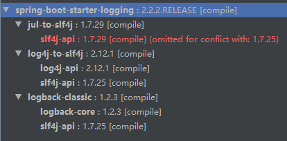

# logback

## 一、引入jar包

```xml
<!-- https://mvnrepository.com/artifact/org.springframework.boot/spring-boot-starter -->
<dependency>
    <groupId>org.springframework.boot</groupId>
    <artifactId>spring-boot-starter-logging</artifactId>
    <version>2.2.2.RELEASE</version>
</dependency>
```

Compile Dependencies :



